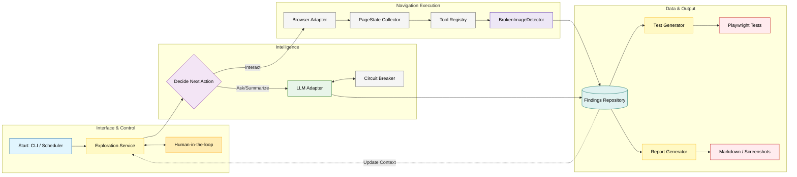
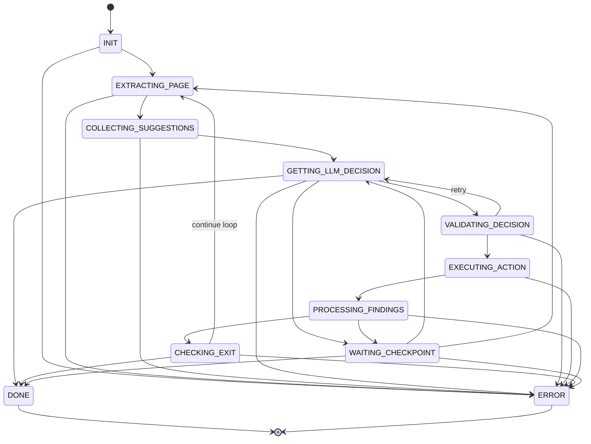
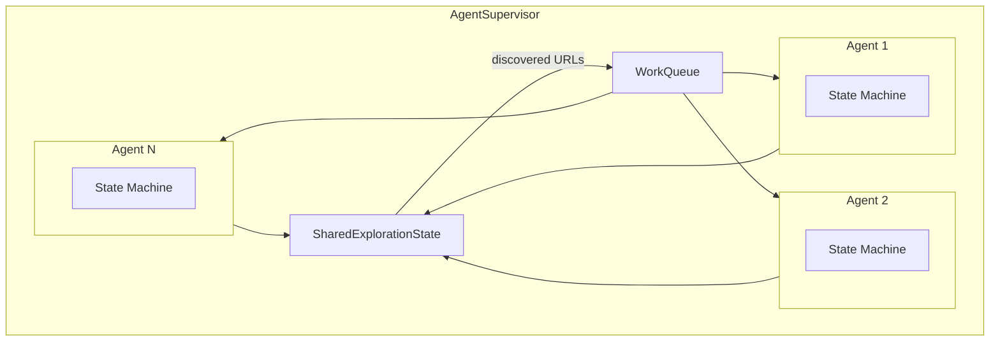

```mermaid
flowchart LR
    %% Entry and Control Nodes
    subgraph Input [Interface & Control]
      A[Start: CLI / Scheduler]:::entry --> B[Exploration Service]:::core
      B <--> N[Human-in-the-loop]:::human
    end

    %% Processing and Intelligence
    subgraph Brain [Intelligence]
      B --> C{Decide Next Action}:::logic
      C -- "Ask/Summarize" --> E[LLM Adapter]:::ai
      E <--> O[Circuit Breaker]:::infra
    end

    %% Execution and Tools
    subgraph Execution [Navigation Execution]
      C -- "Interact" --> D[Browser Adapter]:::infra
      D --> F[PageState Collector]:::infra
      F --> G[Tool Registry]:::infra
      G --> H[BrokenImageDetector]:::tool
    end

    %% Persistence and Results
    subgraph Persistence [Data & Output]
      H --> I[(Findings Repository)]:::data
      E --> I
      I --> J[Test Generator]:::core
      I --> L[Report Generator]:::core
      
      J --> K[Playwright Tests]:::output
      L --> M[Markdown / Screenshots]:::output
    end

    %% Feedback Loop
    I -.->|Update Context| B

    %% Color Styling
    classDef entry fill:#e1f5fe,stroke:#01579b,color:#000
    classDef core fill:#fff9c4,stroke:#fbc02d,color:#000
    classDef logic fill:#f3e5f5,stroke:#7b1fa2,color:#000
    classDef human fill:#ffecb3,stroke:#ffa000,color:#000
    classDef infra fill:#f5f5f5,stroke:#616161,color:#000
    classDef ai fill:#e8f5e9,stroke:#2e7d32,color:#000
    classDef tool fill:#ede7f6,stroke:#5e35b1,color:#000
    classDef data fill:#e0f2f1,stroke:#00695c,color:#000
    classDef output fill:#ffebee,stroke:#c62828,color:#000

    %% Navigation Links
    click E href "src/infrastructure/llm/LLMAdapterFactory.ts" "LLM adapter factory"
    click H href "src/infrastructure/tools/index.ts" "Tools index"
    click I href "src/infrastructure/persistence" "Repository location"
```

## State Machine per Agent

```mermaid
stateDiagram-v2
    [*] --> INIT
    INIT --> EXTRACTING_PAGE
    INIT --> ERROR

    EXTRACTING_PAGE --> COLLECTING_SUGGESTIONS
    EXTRACTING_PAGE --> ERROR

    COLLECTING_SUGGESTIONS --> GETTING_LLM_DECISION
    COLLECTING_SUGGESTIONS --> ERROR

    GETTING_LLM_DECISION --> VALIDATING_DECISION
    GETTING_LLM_DECISION --> WAITING_CHECKPOINT
    GETTING_LLM_DECISION --> DONE
    GETTING_LLM_DECISION --> ERROR

    VALIDATING_DECISION --> EXECUTING_ACTION
    VALIDATING_DECISION --> GETTING_LLM_DECISION: retry
    VALIDATING_DECISION --> ERROR

    EXECUTING_ACTION --> PROCESSING_FINDINGS
    EXECUTING_ACTION --> ERROR

    PROCESSING_FINDINGS --> CHECKING_EXIT
    PROCESSING_FINDINGS --> WAITING_CHECKPOINT
    PROCESSING_FINDINGS --> ERROR

    CHECKING_EXIT --> EXTRACTING_PAGE: continue loop
    CHECKING_EXIT --> DONE
    CHECKING_EXIT --> ERROR

    WAITING_CHECKPOINT --> GETTING_LLM_DECISION
    WAITING_CHECKPOINT --> EXTRACTING_PAGE
    WAITING_CHECKPOINT --> DONE
    WAITING_CHECKPOINT --> ERROR

    DONE --> [*]
    ERROR --> [*]
```

## Multi-Agent Supervisor Pattern

```mermaid
flowchart TB
    subgraph Supervisor[AgentSupervisor]
        WQ[WorkQueue]
        SS[SharedExplorationState]
        WQ --> A1 & A2 & A3
    end

    subgraph A1[Agent 1]
        SM1[State Machine]
    end

    subgraph A2[Agent 2]
        SM2[State Machine]
    end

    subgraph A3[Agent N]
        SM3[State Machine]
    end

    A1 & A2 & A3 --> SS
    SS --> |discovered URLs| WQ
```